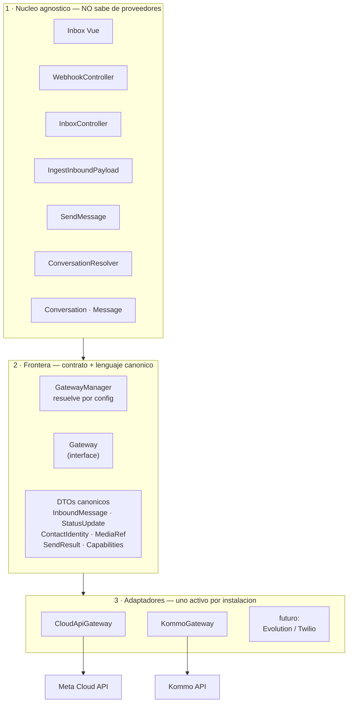
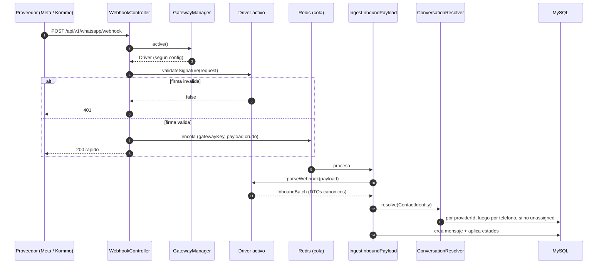
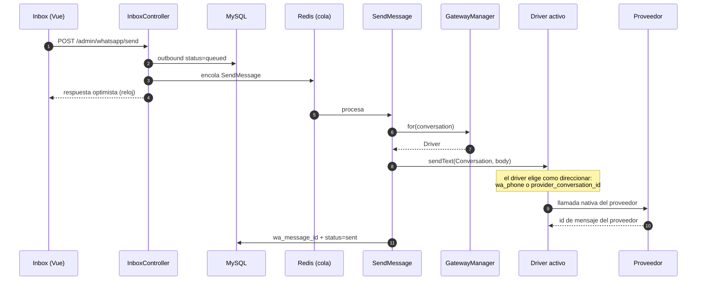
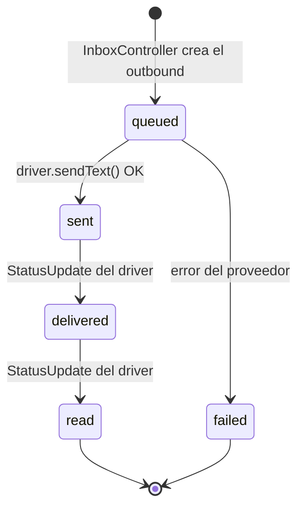
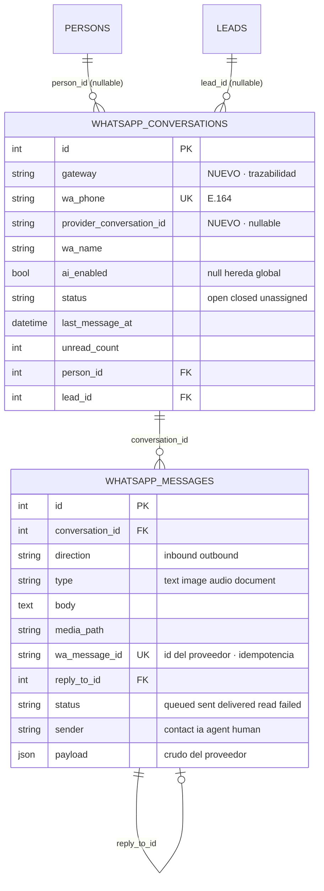

# Arquitectura — Módulo WhatsApp (`Webkul\Whatsapp`)

> Refleja el código construido en `imprimir-modulo-whatsapp` + la capa de gateway propuesta.
> Lo propuesto está marcado como tal; no se mezcla con lo que ya existe.

## Principio rector

**Laravel es el hub y la fuente de verdad.** El webhook apunta directo a Laravel; Laravel persiste,
decide y expone una API. Tanto el **proveedor de mensajería** (Cloud API, Kommo, …) como el
**agente de IA** (n8n u otro) son piezas **intercambiables en los bordes**, nunca intermediarios
obligatorios.

Reglas derivadas:

1. **El webhook nunca procesa inline.** Valida firma → encola → responde 200 en <500ms.
2. **Todo lo lento va a cola** (Redis): ingesta, descarga de media, envío.
3. **Idempotencia por id de mensaje del proveedor**: los webhooks se reintentan.
4. **La conversación se ancla al `Person`**, no al `Lead`. El lead es contexto opcional.
5. **(nuevo)** **Ningún detalle de proveedor cruza al núcleo.** Ver capa de gateway.

## Restricción de despliegue (define el diseño)

**Una instalación = un proveedor activo, elegido por config.** No hay multi-integración
simultánea ni multi-tenant. Cada cliente tiene su propio deploy y su `.env`.

Esto permite simplificar de forma agresiva:

- ❌ No hace falta tabla `whatsapp_channels` ni credenciales en BD ni cifrado por tenant.
- ❌ No hace falta `{driver}` en la URL del webhook: sigue siendo **uno solo**, resuelve el
  gateway configurado. **La configuración actual de Meta no se rompe.**
- ❌ No hace falta unique compuesto `(gateway, wa_message_id)`: con un solo proveedor activo,
  los ids son opacos y no colisionan. El unique simple se mantiene.
- ✅ Cambiar de proveedor = cambiar `WHATSAPP_GATEWAY` + redeploy.

---

# Capa de gateway (propuesta)

## El problema actual

Hoy hay dos fugas de proveedor dentro del núcleo:

- `IngestInboundPayload` conoce `entry → changes → value` — **100% específico de Meta**.
- `SendMessage` instancia `CloudApi` directamente, y `WebhookController` lee
  `config('whatsapp.cloud.app_secret')`.

Cambiar a Kommo hoy significaría reescribir el núcleo. Eso es lo que arregla esta capa.

## Las tres capas



**La regla de oro:** nada específico de un proveedor puede cruzar de la capa 3 a la capa 1.
El único lenguaje que atraviesa la frontera son los DTOs canónicos.

## El contrato

```php
interface Gateway
{
    public function key(): string;
    public function capabilities(): Capabilities;

    // ---- entrada ----
    public function verifyWebhook(Request $r): ?Response;          // null = no hace handshake
    public function authenticateWebhook(Request $r): WebhookAuth;  // ok() / fail(motivo)
    public function webhookSecurity(): WebhookSecurity;            // postura declarada
    public function parseWebhook(array $payload): InboundBatch;
    public function fetchMedia(MediaRef $ref): ?StoredMedia;

    // ---- salida ----
    public function sendText(Conversation $c, string $body, ?string $replyToProviderId = null): SendResult;
    public function sendMedia(Conversation $c, OutboundMedia $m, ?string $replyToProviderId = null): SendResult;
}
```

## Autenticación del webhook — el punto crítico

Cada proveedor autentica de forma **radicalmente distinta**. Un `validateSignature(): bool` asume
el modelo de Meta y se rompe con el resto. Las categorías reales:

| Categoría | Handshake | Auth de cada evento | Fuerza | Ejemplo |
|---|---|---|---|---|
| **A** Firma HMAC | Sí (challenge) | HMAC del *raw body* con app secret | 🟢 Alta | Cloud API |
| **B** Solo URL | No | Ninguna | 🔴 Nula | Kommo |
| **C** Token en header | No | `apikey`/token en header | 🟡 Media | Evolution |
| **D** Firma propia | Depende | HMAC con otro header/algoritmo/encoding | 🟢 Alta | respond.io |

### El riesgo de la categoría B

Si un proveedor solo pide un endpoint y no firma nada, **cualquiera que descubra la URL puede
inyectar mensajes falsos**: crear conversaciones, falsear mensajes de clientes, disparar el agente
de IA. No es teórico.

**Mitigación obligatoria:** secreto de alta entropía en la propia URL, de modo que conocer la URL
*sea* la credencial. Sigue siendo **un solo webhook**:

```
/api/v1/whatsapp/webhook/{secret?}
```

Contrapartida asumida: las URLs se loguean en proxies y access logs. Es peor que una firma, pero es
lo único disponible cuando el proveedor no ofrece nada mejor. Si el proveedor publica rangos de IP,
se suma allowlist.

### Por qué tres métodos y no uno

- **`verifyWebhook()`** → devuelve `null` cuando el proveedor no hace handshake (Kommo, Evolution).
  Meta devuelve el `hub.challenge`.
- **`authenticateWebhook()`** → devuelve `WebhookAuth` con **motivo**, no un bool pelado. Con un bool
  no se puede diagnosticar *por qué* Meta está rechazando.
- **`webhookSecurity()`** → postura declarada del driver. Permite loguear y **alertar cuando un
  cliente corre con seguridad débil o nula**, y que el operador sepa qué tiene montado.

```php
enum WebhookSecurity { case SIGNATURE; case URL_SECRET; case HEADER_TOKEN; case NONE; }

final class WebhookAuth
{
    private function __construct(public bool $ok, public ?string $reason = null) {}

    public static function ok(): self { return new self(true); }
    public static function fail(string $reason): self { return new self(false, $reason); }
}
```

### Helpers compartidos (`BaseGateway`)

```php
abstract class BaseGateway implements Gateway
{
    // SIEMPRE sobre el raw body: re-serializar el JSON cambia el hash.
    protected function hmacMatches(Request $r, string $header, string $secret, string $algo = 'sha256', string $prefix = ''): bool;
    protected function urlSecretMatches(Request $r): bool;      // compara {secret} de la ruta
    protected function headerTokenMatches(Request $r, string $header, string $expected): bool;
}
```

Todos con `hash_equals` (comparación en tiempo constante).

### Otras dos variaciones que obliga el multi-proveedor

- **Idempotencia**: Meta entrega `wamid`. Un proveedor puede no dar id estable → el driver debe
  **sintetizarlo** (hash del payload + timestamp). Por eso `providerMessageId` es obligatorio en el
  DTO: lo garantiza el driver, no el núcleo.
- **Batching**: Meta manda varios eventos por POST (`entry[].changes[]`); otros mandan uno por
  request. Por eso `parseWebhook()` devuelve un `InboundBatch` y nunca un mensaje suelto.

### Ayuda al operador

Comando `whatsapp:webhook-info` → imprime la URL exacta a pegar en el panel del proveedor activo,
qué credenciales espera y su postura de seguridad. Cada proveedor se registra manualmente en su
panel; esto evita el ida y vuelta.

### Decisión clave: el driver recibe la `Conversation`, no un `string $to`

Esto es lo que hace que **la incógnita de Kommo no bloquee el diseño**. Cada driver elige cómo
direccionar:

- `CloudApiGateway` usa `$c->wa_phone`.
- `KommoGateway` usa `$c->provider_conversation_id` (si Kommo direcciona por chat id) **o**
  `$c->wa_phone` (si da teléfono). Se decide **dentro del driver**, sin tocar el núcleo.

### `ContactIdentity` — la identidad deja de asumirse como teléfono

```php
final class ContactIdentity
{
    public function __construct(
        public ?string $phone = null,        // Cloud API: from
        public ?string $providerId = null,   // Kommo: chat/contact id
        public ?string $name = null,
    ) {}
}
```

El `ConversationResolver` pasa a resolver en cascada:

1. `providerId` → busca conversación por `provider_conversation_id`.
2. `phone` → match difuso contra `Person.contact_numbers` (lógica actual, últimos 8 dígitos).
3. Sin match → conversación `unassigned`.

Así el núcleo funciona **tanto si el proveedor da teléfono como si da un id propio**.

### `MediaRef` — normaliza "cómo se obtiene el archivo"

```php
final class MediaRef
{
    public function __construct(
        public string $kind,      // 'id' (Cloud API: requiere 2da llamada) | 'url' (descarga directa)
        public string $value,
        public ?string $mime = null,
        public ?string $filename = null,
    ) {}
}
```
El núcleo solo dice "traeme los bytes"; `fetchMedia()` resuelve la diferencia.

### `Capabilities` — entrega progresiva, no promesa teórica

```php
final class Capabilities
{
    public function __construct(public array $send = [], public array $receive = []) {}
    public function canSend(string $type): bool;
}
```

**Regla:** `capabilities()` declara lo que **el driver realmente implementa hoy**, no lo que el
proveedor soporta en teoría. Cloud API soporta stickers; si `CloudApiGateway::sendMedia()` todavía
no los implementa, `sticker` **no** va en la lista.

Esto convierte el desarrollo en entrega progresiva:

1. El driver arranca con `send: ['text']` → el composer solo muestra el input de texto.
2. Se implementa `sendMedia()` para documentos → se agrega `'document'` → **aparece el botón**.
3. Nunca hay un botón que falle: si está visible, está implementado.

`GET admin/whatsapp/thread` devuelve `capabilities`, y el composer habilita/oculta botones.
**Es exactamente «el front consulta al gateway», pero sin que el front sepa qué proveedor es.**

| Driver | `send` hoy | Objetivo |
|---|---|---|
| `CloudApiGateway` | `text` | `text, image, document, audio, reply` |
| `KommoGateway` | — | según su doc de mensajería |

## Diagrama de clases

```mermaid
classDiagram
    class Gateway {
        <<interface>>
        +key() string
        +capabilities() Capabilities
        +verifyWebhook(Request) Response
        +validateSignature(Request) bool
        +parseWebhook(array) InboundBatch
        +fetchMedia(MediaRef) StoredMedia
        +sendText(Conversation, string, string) SendResult
        +sendMedia(Conversation, OutboundMedia, string) SendResult
    }

    class CloudApiGateway {
        -config
        +parseWebhook() "entry-changes-value"
        +sendText() "POST /{phone_number_id}/messages"
    }

    class KommoGateway {
        -config
        +parseWebhook() "formato Kommo"
        +sendText() "API de mensajeria Kommo"
    }

    class GatewayManager {
        +active() Gateway
        +driver(key) Gateway
        +for(Conversation) Gateway
    }

    class WebhookController
    class IngestInboundPayload
    class SendMessage
    class InboxController

    Gateway <|.. CloudApiGateway
    Gateway <|.. KommoGateway
    GatewayManager ..> Gateway : instancia segun config
    WebhookController ..> GatewayManager : verify + firma
    IngestInboundPayload ..> GatewayManager : parseWebhook
    SendMessage ..> GatewayManager : sendText / sendMedia
    InboxController ..> GatewayManager : capabilities
```

## Cómo queda el núcleo (genérico)

```php
// WebhookController — ya no sabe de Meta
public function receive(Request $r, GatewayManager $gateways)
{
    $gateway = $gateways->active();

    if (! $gateway->validateSignature($r)) {
        return response()->json(['message' => 'Invalid signature'], 401);
    }

    IngestInboundPayload::dispatch($gateway->key(), $r->all())->onQueue(config('whatsapp.queue'));

    return response()->json(['status' => 'ok']);
}

// IngestInboundPayload — ya no parsea nada
$batch = $gateways->driver($this->gatewayKey)->parseWebhook($this->payload);

foreach ($batch->messages as $inbound) { $this->persist($inbound); }
foreach ($batch->statuses as $status) { $this->applyStatus($status); }

// SendMessage — ya no instancia CloudApi
$gateway = $gateways->for($message->conversation);
$result  = $gateway->sendText($message->conversation, $message->body, $replyToProviderId);
```

## Configuración

```php
'gateway' => env('WHATSAPP_GATEWAY', 'cloud_api'),   // el único activo

'gateways' => [
    'cloud_api' => [
        'driver'          => CloudApiGateway::class,
        'phone_number_id' => env('WHATSAPP_PHONE_NUMBER_ID'),
        'token'           => env('WHATSAPP_TOKEN'),
        'app_secret'      => env('WHATSAPP_APP_SECRET'),
        'verify_token'    => env('WHATSAPP_VERIFY_TOKEN'),
        'api_version'     => env('WHATSAPP_API_VERSION', 'v21.0'),
    ],

    'kommo' => [
        'driver'   => KommoGateway::class,
        'base_url' => env('KOMMO_BASE_URL'),
        'token'    => env('KOMMO_TOKEN'),
        'scope_id' => env('KOMMO_SCOPE_ID'),
        'secret'   => env('KOMMO_SECRET'),
    ],
],
```

**Cada driver recibe su propio array de config inyectado.** El núcleo nunca vuelve a leer
`config('whatsapp.cloud.*')` — eso pasa a ser privado del driver. (Hoy `WebhookController` lo lee:
esa fuga se elimina.)

## Cambios de esquema que introduce la capa

| Columna | Tabla | Por qué |
|---|---|---|
| `gateway` | `whatsapp_conversations` | Trazabilidad + permite `for(Conversation)` si algún día se migra de proveedor |
| `provider_conversation_id` | `whatsapp_conversations` | Para proveedores que direccionan por chat id en vez de teléfono (indexado, nullable) |

`wa_message_id` **se mantiene con unique simple**: con un solo proveedor activo no hay colisión posible.

## Estructura de archivos propuesta

```
src/
  Gateways/
    Contracts/Gateway.php
    GatewayManager.php
    Dto/
      Capabilities.php  ContactIdentity.php  InboundBatch.php
      InboundMessage.php  MediaRef.php  OutboundMedia.php
      SendResult.php  StatusUpdate.php  StoredMedia.php
    CloudApi/CloudApiGateway.php     ← absorbe el actual Services/CloudApi + el parseo de IngestJob
    Kommo/KommoGateway.php
  Http/Controllers/{WebhookController, InboxController}.php   ← se vuelven agnósticos
  Jobs/{IngestInboundPayload, SendMessage}.php                ← se vuelven agnósticos
  Services/{ConversationResolver, PhoneNumber}.php            ← resolver pasa a usar ContactIdentity
  Models/{Conversation, Message}.php
```

## Qué NO puede cruzar la frontera (checklist de revisión)

- El núcleo **no** lee config de un driver concreto.
- El núcleo **no** conoce formatos de payload ni nombres de campos del proveedor.
- El núcleo **no** asume que la identidad es un teléfono (usa `ContactIdentity`).
- El núcleo **no** asume que la media se obtiene por URL ni por id (usa `MediaRef`).
- Los drivers **no** escriben en Eloquent; solo leen la `Conversation` para direccionar.

---

# Flujos (con la capa de gateway)

## Entrada



## Salida



## Estado de un mensaje



Cada driver mapea sus estados nativos a los canónicos. El *rank guard*
(`queued 0 < sent 1 < delivered 2 < read 3`) vive en el núcleo y evita retrocesos por callbacks
fuera de orden.

# Modelo de datos



# Estado real

| Componente | Estado |
|---|---|
| Webhook verify + firma | ✅ Construido (acoplado a Meta) |
| Ingesta idempotente | ✅ Construido (parseo acoplado a Meta) |
| Estados delivered/read | ✅ Construido |
| Teléfono → Person + unassigned | ✅ Construido |
| Envío de texto | ✅ Construido y verificado |
| Inbox en Lead y Person | ✅ Construido |
| Actualización en vivo | ⚠️ Polling 4s (cursor `since`) |
| **Capa de gateway** | 📐 **Diseñada, no implementada** |
| Driver Kommo | ⛔ Requiere doc de su API |
| Media (imagen/audio/doc) | ⛔ Pendiente |
| Reverb (tiempo real) | ⛔ Pendiente |
| Switch IA + webhook agente + Swagger | ⛔ Pendiente |
| Tests Pest | ⛔ Pendiente |

# Deuda asumida a propósito

- **Polling 4s** en vez de websockets: pragmático para el MVP. Reverb lo reemplaza sin tocar el
  resto (el front ya hace merge por id).
- **Ventana de 24h de Meta**: fuera de ella se requieren plantillas aprobadas, no implementadas.
  *Nota: esta regla es de Cloud API; otros proveedores tienen las suyas. Cuando importe, se expresa
  como otra capability del gateway.*
- **Match difuso por 8 dígitos**: heurístico. Mitigado con `whatsapp:normalize-phones`.
- **Historial de n8n**: la pestaña «Historial IA» sigue intacta y separada; no se migró.
