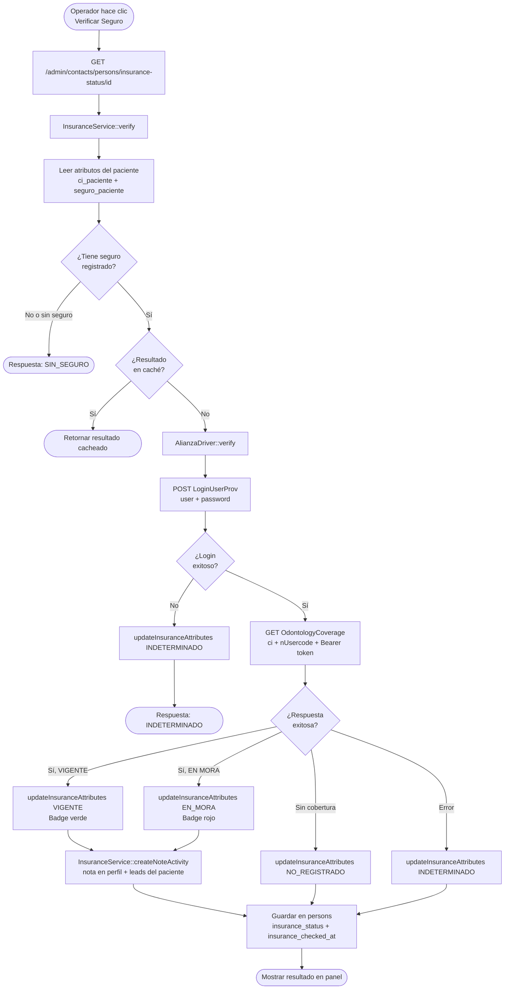
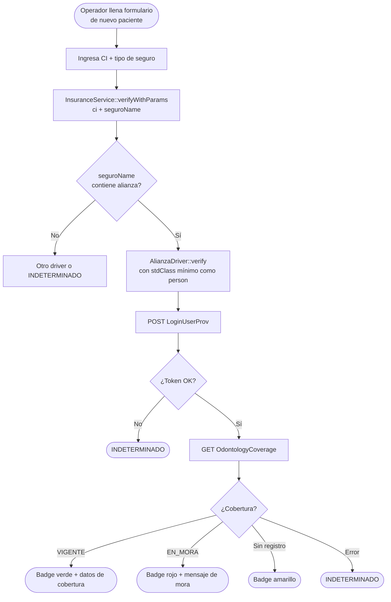
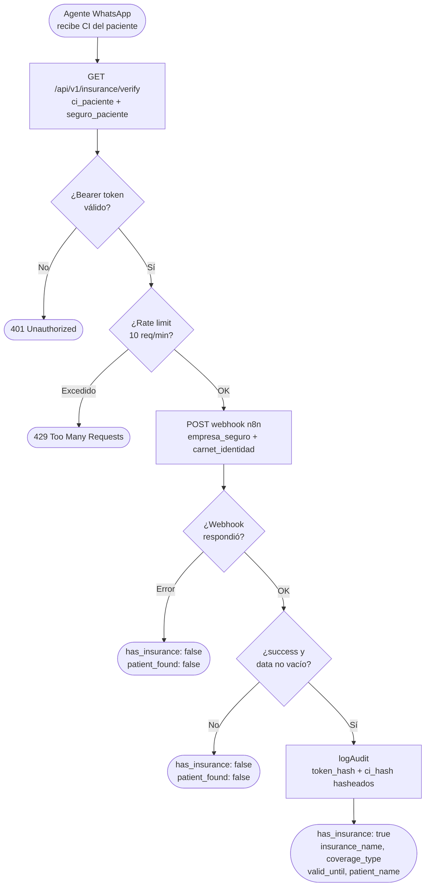
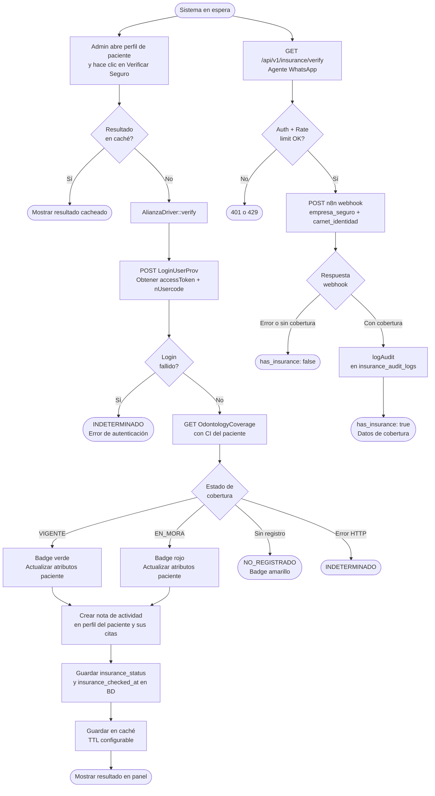

# Informe de Integración — Alianza Seguros × Odontoking CRM

**Fecha:** 2026-06-02
**Versión:** 1.0
**Preparado por:** Equipo Técnico Odontoking / Sofopolis Srl

---

## Índice

1. [Resumen ejecutivo](#1-resumen-ejecutivo)
2. [Inventario de integración](#2-inventario-de-integración)
3. [Diagramas de flujo](#3-diagramas-de-flujo)
4. [Diagrama de actividades — Ciclo completo](#4-diagrama-de-actividades--ciclo-completo)
5. [Configuración y entornos](#5-configuración-y-entornos)

---

## 1. Resumen ejecutivo

Odontoking CRM integra la API de Alianza Seguros para verificar en tiempo real la cobertura dental de los pacientes. La integración opera en dos flujos principales:

- **Verificación desde el panel administrativo:** el operador consulta manualmente el seguro de un paciente desde su perfil.
- **Verificación desde el agente WhatsApp:** verificación automática por CI a través de un webhook n8n, con respuesta anti-enumeración.

| # | Flujo | Disparador |
|---|---|---|
| A | Verificación manual desde el CRM | Admin panel |
| B | Verificación desde creación de paciente | Formulario de alta |
| C | Verificación vía API REST (agente WhatsApp) | GET /api/v1/insurance/verify |

---

## 2. Inventario de integración

### 2.1 Configuración

| Variable de entorno | Descripción |
|---|---|
| `ALIANZA_USER` | Usuario de autenticación para la API de Alianza (`cli.odontok`) |
| `ALIANZA_PASS` | Contraseña de autenticación para la API de Alianza |

### 2.2 Servicios

| Clase | Responsabilidad |
|---|---|
| `AlianzaDriver` | Driver de verificación de cobertura. Realiza login y consulta de cobertura contra la API de Alianza. |
| `InsuranceService` | Orquestador central. Resuelve el driver según el seguro del paciente, gestiona caché y persiste resultados. |

### 2.3 Endpoints expuestos por Odontoking (recepción)

| Método | URI | Descripción | Seguridad |
|---|---|---|---|
| `POST` | `/api/insurance/verify` | Verificación directa con person_id + CI + tipo de seguro | Bearer token Sanctum |
| `GET` | `/api/v1/insurance/verify` | Verificación para agente WhatsApp por CI | Bearer token, rate limit 10 req/min |

### 2.4 Endpoints de Alianza Seguros consumidos por Odontoking

| Método HTTP | Endpoint | Propósito |
|---|---|---|
| `POST` | `{base_url}/LoginUserProv` | Autenticación — obtiene `accessToken` y `nUsercode` |
| `GET` | `{base_url}/OdontologyCoverage?ci={ci}&nUsercode={nUsercode}` | Verificación de cobertura dental por CI |

> **Base URL actual (desarrollo):** `https://devnet.alianza.com.bo/ApiGateway`
> **Base URL producción:** a proveer por Alianza Seguros

### 2.5 Estructura de la respuesta de cobertura

Campos que Odontoking extrae de la respuesta de `OdontologyCoverage`:

| Campo Alianza | Uso en Odontoking |
|---|---|
| `ESTADO` | Estado del asegurado (`VIGENTE`, `EN MORA`, etc.) |
| `NRO. DOCUMENTO` | CI del asegurado |
| `CONTRATANTE` | Nombre del contratante |
| `NOMBRE COMPLETO` | Nombre del paciente |
| `EDAD` | Edad |
| `CODIGO DE ASEGURADO` | Código interno Alianza |
| `COBERTURA ADICIONAL ODONTOLOGICA` | Tipo de cobertura dental |
| `COASEGURO ODONTOLOGICO` | Porcentaje de coaseguro |
| `CLINICA ODONTOLOGICA` | Clínica asignada |
| `RELACION` | Relación con el contratante |
| `FECHA DE INGRESO` | Fecha de ingreso al seguro |

### 2.6 Estados manejados por Odontoking

| Estado interno | Condición | Acción en CRM |
|---|---|---|
| `VIGENTE` | `ESTADO == VIGENTE` en respuesta Alianza | Badge verde, nota de actividad creada |
| `EN_MORA` | `messageError` contiene "pago pendiente" | Badge rojo, nota de actividad creada |
| `NO_REGISTRADO` | Respuesta exitosa pero sin cobertura | Badge amarillo |
| `INDETERMINADO` | Error de conexión o autenticación fallida | Sin badge, log de error |
| `SIN_SEGURO` | Paciente no tiene seguro registrado en el CRM | Badge amarillo |

### 2.7 Persistencia

| Tabla | Campo | Propósito |
|---|---|---|
| `persons` | `insurance_status` (string, nullable) | Último estado de cobertura obtenido |
| `persons` | `insurance_checked_at` (timestamp, nullable) | Fecha y hora de la última verificación |
| `attribute_values` | `estado_seguro_paciente` | Atributo custom con el estado del seguro (por persona) |
| `attribute_values` | `estado_seguro_paciente_cita` | Atributo custom replicado en cada cita/lead del paciente |
| `activities` | tipo `note` | Nota de actividad creada automáticamente con el detalle de cobertura |
| `insurance_audit_logs` | `token_hash`, `ci_hash`, `seguro_hash`, `result`, `ip_address` | Log de auditoría de cada verificación (datos hasheados, sin PII en claro) |

---

## 3. Diagramas de flujo

### Flujo A: Verificación manual desde el panel CRM

---

### Flujo B: Verificación desde formulario de creación de paciente

---

### Flujo C: Verificación vía API REST — Agente WhatsApp

---

## 4. Diagrama de actividades — Ciclo completo

---

## 5. Configuración y entornos

### Variables de entorno

| Variable | Entorno desarrollo | Entorno producción | Notas |
|---|---|---|---|
| `ALIANZA_USER` | `cli.odontok` | A proveer por Alianza | Credencial de proveedor |
| `ALIANZA_PASS` | `97531` | A proveer por Alianza | Contraseña temporal en dev |
| `ALIANZA_BASE_URL` | `https://devnet.alianza.com.bo/ApiGateway` | URL a proveer por Alianza | Hardcodeada en `AlianzaDriver`, debe externalizarse para producción |

### IP del servidor Odontoking

| Entorno | IP | Ubicación |
|---|---|---|
| Desarrollo / Producción | `76.13.69.34` | Brasil — São Paulo (Ubuntu 24.04) |

### Caché de verificaciones

Los resultados de verificación se cachean para evitar consultas repetitivas a la API de Alianza:

| Parámetro | Valor |
|---|---|
| TTL por defecto | 3600 segundos (1 hora) |
| Configurable via | `services.insurance.cache_ttl` |
| Habilitado via | `services.insurance.cache_enabled` |
| Invalidación manual | `InsuranceService::forceVerify(personId)` |

### Auditoría

Cada verificación vía API queda registrada en `insurance_audit_logs` con datos hasheados (SHA-256). Nunca se almacena CI, token ni nombre en texto claro.

### Archivos clave de referencia

| Archivo | Descripción |
|---|---|
| `packages/Webkul/Admin/src/Services/Insurance/Drivers/AlianzaDriver.php` | Driver de verificación — login y consulta de cobertura |
| `packages/Webkul/Admin/src/Services/InsuranceService.php` | Orquestador de seguros con caché y persistencia |
| `packages/Webkul/Admin/src/Http/Controllers/Api/InsuranceController.php` | Endpoints REST de verificación |
