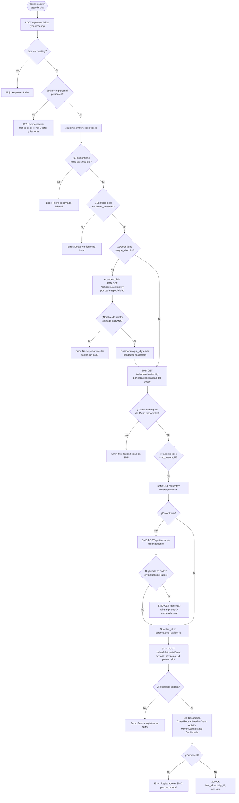
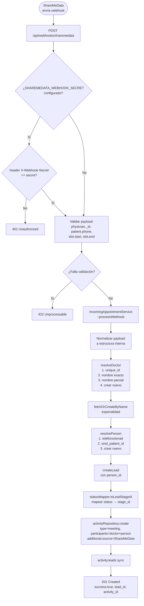
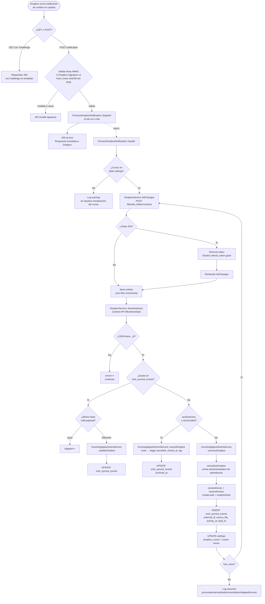
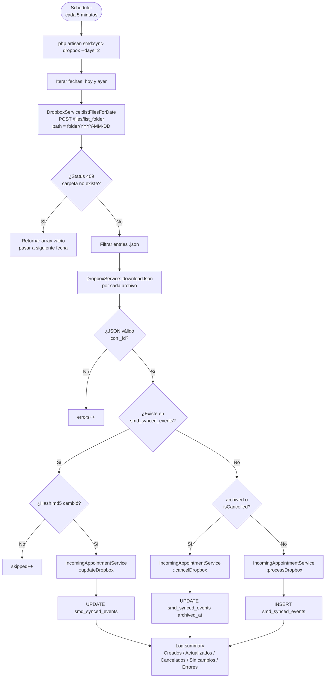
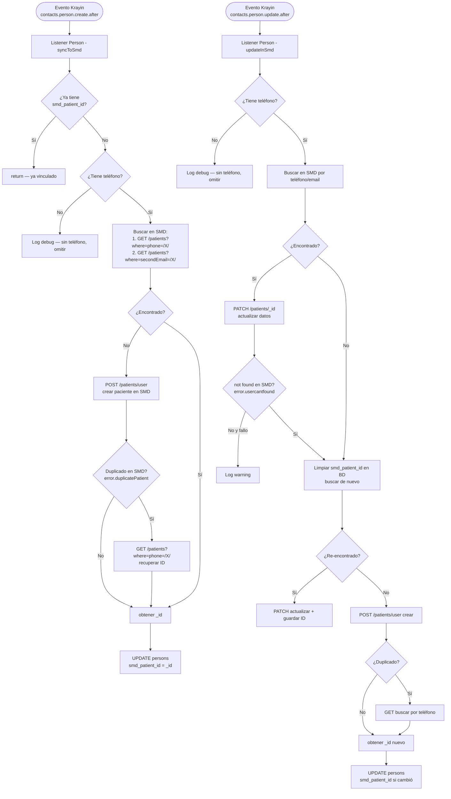
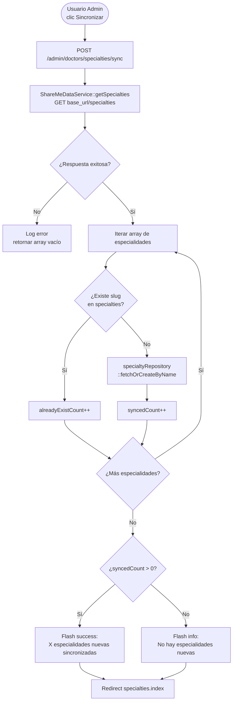
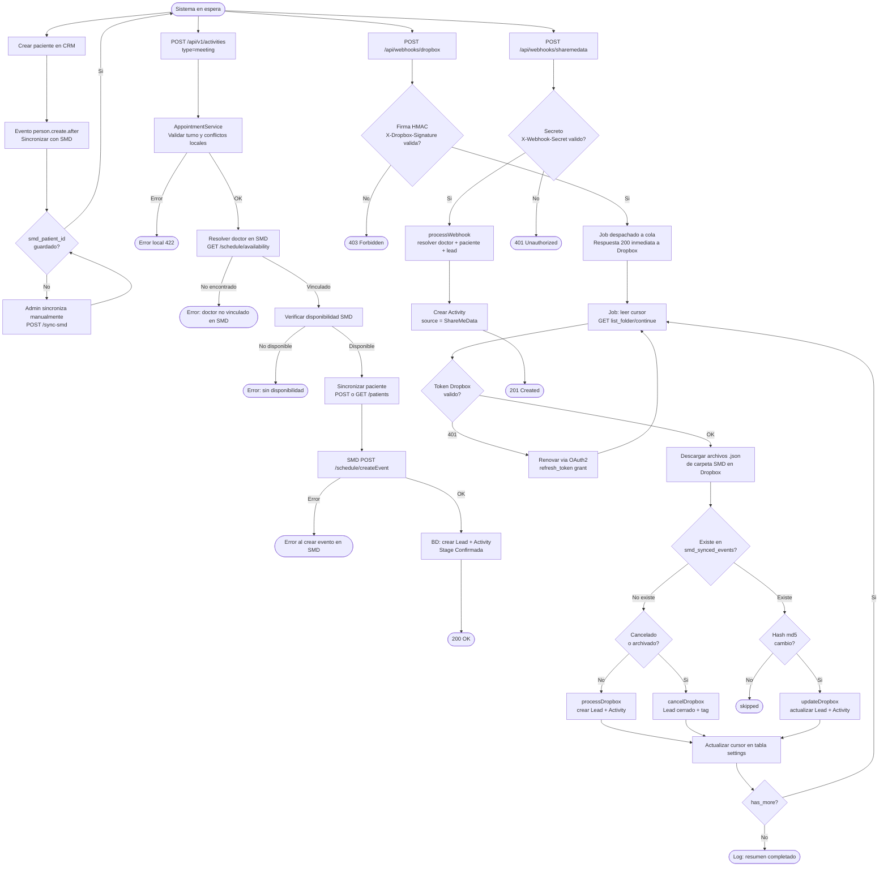

# Informe de Integración — ShareMeData × Odontoking CRM

**Fecha:** 2026-05-22
**Versión:** 1.0
**Preparado por:** Equipo Técnico Odontoking

***

## Índice

1. [Resumen ejecutivo](#1-resumen-ejecutivo)
2. [Inventario de integración](#2-inventario-de-integración)
3. [Diagramas de flujo](#3-diagramas-de-flujo)
4. [Diagrama de actividades — Ciclo completo](#4-diagrama-de-actividades--ciclo-completo)
5. [Configuración y entornos](#5-configuración-y-entornos)

***

## 1. Resumen ejecutivo

Odontoking CRM integra el sistema ShareMeData (SMD) en seis flujos de negocio distintos que cubren la gestión completa del ciclo de vida de una cita dental: desde la creación hasta la cancelación, pasando por la sincronización de pacientes y especialidades.

La integración opera en dos modos complementarios:

- **Saliente (CRM → SMD):** creación de citas y sincronización de pacientes.
- **Entrante (SMD → CRM):** recepción de citas y actualizaciones de estado vía webhook directo y vía Dropbox (webhook + polling de respaldo).

| # | Flujo                                  | Dirección     |
| - | -------------------------------------- | ------------- |
| A | Creación de cita                       | CRM → SMD     |
| B | Webhook directo                        | SMD → CRM     |
| C | Webhook Dropbox (tiempo real)          | Dropbox → CRM |
| D | Polling Dropbox (respaldo, cada 5 min) | Dropbox → CRM |
| E | Sincronización de paciente             | CRM ↔ SMD     |
| F | Sincronización de especialidades       | SMD → CRM     |

***

## 2. Inventario de integración

### 2.1 Configuración

| Variable de entorno           | Descripción                                                    |
| ----------------------------- | -------------------------------------------------------------- |
| `SHAREMEDATA_API_KEY`         | API Key de autenticación para calendario y pacientes           |
| `SHAREMEDATA_BASE_URL`        | URL base de la API de calendario (incluye `/api/calendar`)     |
| `SHAREMEDATA_PATIENTS_URL`    | URL base de la API de pacientes                                |
| `SHAREMEDATA_WEBHOOK_SECRET`  | Secreto HMAC para validar webhooks directos de SMD             |
| `DROPBOX_ACCESS_TOKEN`        | Token de acceso Dropbox (fallback)                             |
| `DROPBOX_REFRESH_TOKEN`       | Refresh token OAuth2 de Dropbox (credencial principal)         |
| `DROPBOX_APP_KEY`             | App key de la aplicación Dropbox                               |
| `DROPBOX_APP_SECRET`          | App secret de Dropbox (validación firma HMAC del webhook)      |
| `DROPBOX_APPOINTMENTS_FOLDER` | Ruta de la carpeta Dropbox donde SMD deposita los eventos JSON |

### 2.2 Servicios

| Clase                        | Responsabilidad                                                                                                                                                                                                               |
| ---------------------------- | ----------------------------------------------------------------------------------------------------------------------------------------------------------------------------------------------------------------------------- |
| `ShareMeDataService`         | Cliente HTTP hacia la API SMD. Métodos: `getSpecialties`, `syncSpecialties`, `checkAvailability`, `searchPatient`, `searchPatientByCi`, `searchPatientByEmail`, `createPatient`, `getPatient`, `updatePatient`, `createEvent` |
| `DropboxService`             | Cliente HTTP Dropbox con auto-renovación de token OAuth2. Métodos: `listFilesForDate`, `getInitialCursor`, `listChanges`, `downloadJson`                                                                                      |
| `AppointmentService`         | Orquesta la creación de citas: valida turno local, conflictos locales, disponibilidad SMD y crea el evento en SMD antes de persistir localmente                                                                               |
| `IncomingAppointmentService` | Procesa citas entrantes desde SMD (webhook directo y Dropbox). Normaliza, resuelve doctor/paciente/lead, crea actividad                                                                                                       |
| `SmdStatusMapper`            | Mapea el campo `status` de SMD (`confirmed`, `completed`, `canceled`, `no-show`) a stages del pipeline local                                                                                                                  |

### 2.3 Endpoints expuestos por Odontoking (recepción)

| Método | URI                         | Descripción                       | Seguridad                               |
| ------ | --------------------------- | --------------------------------- | --------------------------------------- |
| `POST` | `/api/webhooks/sharemedata` | Webhook directo SMD               | Secreto `X-Webhook-Secret`              |
| `GET`  | `/api/webhooks/dropbox`     | Handshake de verificación Dropbox | Ninguna (requerido por Dropbox)         |
| `POST` | `/api/webhooks/dropbox`     | Notificación de cambios Dropbox   | Firma HMAC-SHA256 `X-Dropbox-Signature` |

### 2.4 Endpoints SMD consumidos por Odontoking

| Método HTTP | Endpoint                                        | Propósito                          |
| ----------- | ----------------------------------------------- | ---------------------------------- |
| `GET`       | `{base_url}/specialties`                        | Obtener listado de especialidades  |
| `GET`       | `{base_url}/schedule/availability`              | Consultar disponibilidad de médico |
| `POST`      | `{base_url}/schedule/createEvent`               | Crear cita en SMD                  |
| `GET`       | `{patients_url}/patients?where=phone=/X/`       | Buscar paciente por teléfono       |
| `GET`       | `{patients_url}/patients?where=personID=/X/`    | Buscar paciente por CI             |
| `GET`       | `{patients_url}/patients?where=secondEmail=/X/` | Buscar paciente por email          |
| `POST`      | `{patients_url}/patients/user`                  | Crear paciente                     |
| `GET`       | `{patients_url}/patients/{id}`                  | Obtener paciente por ID            |
| `PATCH`     | `{patients_url}/patients/{id}`                  | Actualizar paciente                |

### 2.5 Persistencia

| Tabla               | Campo                                        | Propósito                                                                |
| ------------------- | -------------------------------------------- | ------------------------------------------------------------------------ |
| `persons`           | `smd_patient_id` (string, nullable)          | ID del paciente en SMD (`_id` de MongoDB)                                |
| `persons`           | `insurance_status` (string, nullable)        | Estado del seguro obtenido de SMD                                        |
| `persons`           | `insurance_checked_at` (timestamp, nullable) | Última verificación de seguro                                            |
| `smd_synced_events` | tabla completa                               | Registro de deduplicación de eventos procesados desde Dropbox            |
| `smd_synced_events` | `external_id` (unique)                       | ID del evento en SMD — garantiza idempotencia                            |
| `smd_synced_events` | `source_file`                                | Archivo Dropbox origen                                                   |
| `smd_synced_events` | `activity_id`, `lead_id`                     | Referencias locales creadas                                              |
| `smd_synced_events` | `raw_payload`, `status`                      | Payload original y estado de procesamiento                               |
| `smd_synced_events` | `archived_at`                                | Marca de cancelación                                                     |
| `doctors`           | `unique_id`                                  | `_id` del médico en SMD, usado para disponibilidad y creación de eventos |
| `settings`          | `key = 'dropbox_cursor'`                     | Cursor de posición en la API `list_folder/continue` de Dropbox           |

***

## 3. Diagramas de flujo

### Flujo A: Creación de cita saliente (CRM → SMD)

***

### Flujo B: Webhook directo SMD → CRM

***

### Flujo C: Webhook Dropbox — notificación de cambios (tiempo real)

***

### Flujo D: Polling Dropbox — sincronización periódica (respaldo)

***

### Flujo E: Sincronización de paciente (CRM ↔ SMD)

***

### Flujo F: Sincronización de especialidades (SMD → CRM)

***

## 4. Diagrama de actividades — Ciclo completo

***

## 5. Configuración y entornos

### Variables de entorno

| Variable                      | Entorno testing                                  | Entorno producción                    | Notas                                          |
| ----------------------------- | ------------------------------------------------ | ------------------------------------- | ---------------------------------------------- |
| `SHAREMEDATA_BASE_URL`        | `http://gamma.sharemedata.com:3000/api/calendar` | `https://{dominio-prod}/api/calendar` | A confirmar con SMD                            |
| `SHAREMEDATA_PATIENTS_URL`    | `https://gamma.sharemedata.com/api`              | `https://{dominio-prod}/api`          | A confirmar con SMD                            |
| `SHAREMEDATA_API_KEY`         | token de pruebas                                 | token de producción                   | A proveer por SMD                              |
| `SHAREMEDATA_WEBHOOK_SECRET`  | no definido en testing                           | definido en producción                |                                           |
| `DROPBOX_REFRESH_TOKEN`       | no definido en testing                           | token OAuth2 activo                   | Credencial principal                           |
| `DROPBOX_APP_KEY`             | no definido en testing                           | `lgyil7bcotmhcjz`                     |                                           |
| `DROPBOX_APP_SECRET`          | no definido en testing                           | definido                              | Validación HMAC                                |
| `DROPBOX_APPOINTMENTS_FOLDER` | no definido en testing                           | `/smd-events/{org_id}`                | El `org_id` es el ID de la organización en SMD |

### Cobertura de tests automatizados

Los siguientes escenarios cuentan con tests automáticos (Pest PHP) verificados en el repositorio:

- Validación de secreto webhook SMD (token válido, inválido, sin configuración)
- Validación de firma HMAC webhook Dropbox (firma válida, inválida, ausente)
- Handshake GET de Dropbox (challenge)
- Procesamiento nuevo, actualización por hash diferente, skip por hash igual, cancelación por `CANCELED` y por `archived`
- Paginación con `has_more=true` en el job
- Renovación de token Dropbox (401 → refresh → retry)
- Sincronización de paciente: crear, duplicado, not\_found, sin teléfono
- Búsqueda SMD: por teléfono, por CI, por email, fallback entre los tres
- Resolución de doctor: por unique\_id, por nombre exacto, por nombre parcial, creación nueva
- Mapeo de status SMD a stage\_id (todos los estados: `confirmed`, `completed`, `canceled`, `no-show`)
- Inicialización del cursor con `has_more` paginado

### Archivos clave de referencia

| Archivo                                                             | Descripción                                 |
| ------------------------------------------------------------------- | ------------------------------------------- |
| `packages/Webkul/Admin/src/Services/ShareMeDataService.php`         | Cliente HTTP completo hacia la API SMD      |
| `packages/Webkul/Admin/src/Services/AppointmentService.php`         | Flujo de creación de cita                   |
| `packages/Webkul/Admin/src/Services/IncomingAppointmentService.php` | Procesamiento de citas entrantes            |
| `packages/Webkul/Admin/src/Services/DropboxService.php`             | Cliente Dropbox con OAuth2                  |
| `packages/Webkul/Admin/src/Jobs/ProcessDropboxNotification.php`     | Job asíncrono de procesamiento              |
| `config/smd.php`                                                    | Configuración de mapeo de estados y Dropbox |
| `config/services.php`                                               | Credenciales SMD                            |
| `routes/api.php`                                                    | Definición de endpoints públicos            |

