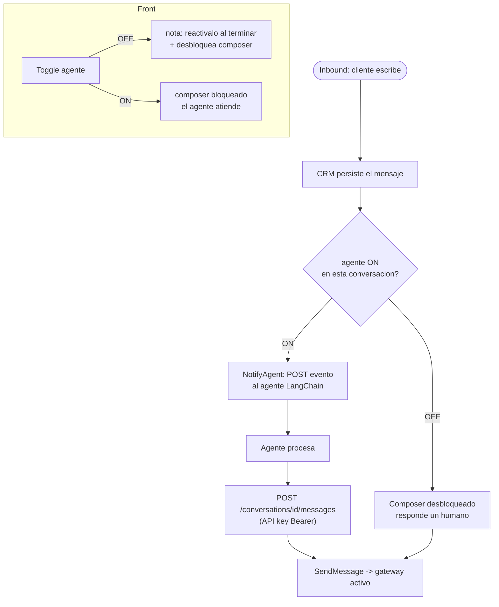

# Sprint IA — Agente, ventana de 24h y API para el agente

> El CRM es el cerebro. El agente (LangChain, en otro proyecto) es un consumidor
> externo: el CRM le manda eventos y él responde por una API documentada.

## Decisiones tomadas

| Tema | Decisión |
|---|---|
| Topología | **A — el CRM orquesta.** Si el agente está OFF, el CRM no le manda eventos |
| Doble respuesta (humano vs IA) | **Toma humana:** para escribir desde el front, el asesor primero **desactiva** el agente. Con el agente ON el composer está bloqueado |
| Al desactivar | Mostrar nota recordatoria: *"Desactivaste el agente — reactivalo al terminar"* |
| Ventana 24h | Aplica a **ambos** gateways (los dos entregan sobre WhatsApp/WABA). El error `3108` lo confirma |
| Endpoint del agente | Expuesto con **API key de usuario (Bearer token)**, como el resto de la REST API de Krayin, y en **Swagger** |
| IA por defecto en conversación nueva | **ON** |
| Registro por día en el chat | Agregar separadores de fecha (hoy solo se ve la hora) |

## Supuesto a confirmar (no bloquea)

n8n **ya no responde solo** por su cuenta: el salesbot pasó a ser únicamente el
transporte de texto de Kommo, y la decisión de IA ahora vive en el agente
LangChain que el CRM dispara. Si n8n siguiera auto-respondiendo en paralelo,
habría doble respuesta. El plan asume que no.

## Flujo con toma humana



---

## Historias

### HU-IA-0 · Separadores de fecha en el chat — `[FRONT]`
Hoy cada mensaje muestra solo `H:i`; no se sabe de qué día es.
- `thread` agrega `date` (Y-m-d) o `created_at` ISO a cada mensaje.
- El front inserta un separador entre días: **Hoy / Ayer / 15 jul 2026**.
**AC:** una conversación con mensajes de varios días muestra un separador por día.

### HU-IA-1 · Ventana de 24h (ambos gateways) — `[BACK · FRONT]`
- Migración: `last_inbound_at` en `whatsapp_conversations` (+ backfill del máximo inbound existente).
- Se actualiza en cada inbound (en `IngestInboundPayload`).
- Rasgo del gateway `messagingWindowHours(): ?int` → 24 para Cloud API y Kommo, `null` para un futuro canal no-WhatsApp.
- `thread` devuelve `window: { applies, open, expires_at, seconds_left }`.
- Front: badge con cuenta regresiva; ventana cerrada → composer deshabilitado + aviso *"Ventana de 24h cerrada. Esperá que el cliente responda."*
**AC:**
- Conversación con inbound hace <24h → ventana abierta con contador.
- Hace >24h (o sin inbound) → cerrada, no deja escribir.
- **Fuera de alcance:** enviar plantillas aprobadas (feature aparte).

### HU-IA-2 · Switch del agente por conversación + toma humana — `[BACK · FRONT]`
- `PUT /admin/whatsapp/conversations/{id}/agent` `{enabled: bool}` → setea `ai_enabled`.
- `thread` devuelve `ai_enabled` (crudo) y `ai_effective` (con herencia del global).
- Front:
  - Toggle cableado al endpoint.
  - Agente **ON** → composer **bloqueado** (overlay: *"El agente está atendiendo. Desactivalo para escribir"*).
  - Al pasar a **OFF** → nota recordatoria + composer desbloqueado.
  - Conversación nueva nace con IA **ON**.
- Refuerzo servidor: el `send` humano (admin) **rechaza** si el agente está ON (defensa en profundidad).
**AC:**
- Con agente ON no se puede escribir a mano; hay que desactivarlo primero.
- Al desactivar aparece la nota y se habilita el composer.

### HU-IA-3 · API para el agente (Swagger + Bearer) — `[BACK]`
Bajo la REST API de Krayin (`api/v1`), auth Sanctum (Bearer = API key de usuario):
- `POST /api/v1/whatsapp/conversations/{id}/messages` — el agente responde. `sender=ia`. Va por `SendMessage` → gateway activo. **Rechaza si la ventana de 24h está cerrada** con motivo claro.
- `GET /api/v1/whatsapp/conversations/{id}/messages` — historial para contexto.
- Anotado en **OpenAPI/Swagger** (`l5-swagger` ya instalado) → visible en `/api/documentation`.
**AC:**
- Token inválido → 401.
- El agente envía y el mensaje sale por el gateway activo con `sender=ia`.
- Importar el spec en el agente muestra request/response.

### HU-IA-4 · Enviador de eventos al agente — `[BACK]`
- Config: `whatsapp.ai.webhook_url`, `whatsapp.ai.token` (Bearer hacia el agente), `whatsapp.ai.history_size` (def. 15).
- Al persistir un inbound, si `aiEffective()` es true → encola `NotifyAgent`.
- `NotifyAgent` hace `POST` al agente con el contrato (abajo). Reintentos con backoff.
- Con agente OFF **no** dispara (esto resuelve la doble respuesta).
**AC:**
- Agente ON → el agente recibe el evento del contrato.
- Agente OFF → cero eventos.

## Contrato del evento hacia el agente

```jsonc
{
  "event": "message.received",
  "conversation_id": 12,
  "gateway": "kommo",
  "ai_enabled": true,
  "contact": { "phone": "+591...", "name": "Alejandro", "person_id": 1, "lead_id": 78 },
  "message": { "id": 101, "type": "text", "text": "hola", "timestamp": "..." },
  "history": [ { "role": "user|assistant", "content": "...", "type": "text" } ],
  "window":  { "open": true, "expires_at": "..." },
  "reply": { "method": "POST", "url": "/api/v1/whatsapp/conversations/12/messages" }
}
```
El CRM firma el evento con `whatsapp.ai.token` (Bearer) para que el agente sepa que es el CRM.
El agente responde con **su** API key de usuario al `reply.url`.

## Defaults que asumo (decime si cambian)

- **Historial en el evento:** últimos 15 mensajes + datos de contacto/lead. Custom fields del lead: **no** por ahora (se agregan si el agente los pide).
- **Ventana cerrada + agente intenta responder:** el endpoint **rechaza** con motivo (no encola).
- **URL y token del agente:** los ponés en `.env` (`WHATSAPP_AGENT_WEBHOOK_URL`, `WHATSAPP_AGENT_TOKEN`).
- **Fallos de entrega de Kommo (3108):** por ahora solo nos guiamos por el cálculo de 24h. Si Kommo nos manda webhook de fallo, lo capturamos en una iteración siguiente.

## Orden de implementación

1. **HU-IA-0** (fecha por día) — chico, aislado, sin riesgo.
2. **HU-IA-1** (ventana 24h) — evita que el asesor mande a ciegas y choque con el 3108.
3. **HU-IA-2** (switch + toma humana) — habilita el chat humano sin doble respuesta.
4. **HU-IA-3** (API + Swagger) — para que el agente pueda responder.
5. **HU-IA-4** (enviador de eventos) — cierra el lazo: el agente recibe y responde.

Nota: 3 y 4 se prueban juntos (el agente necesita ambos para el ida y vuelta).
```
